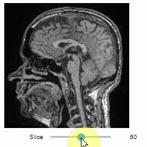
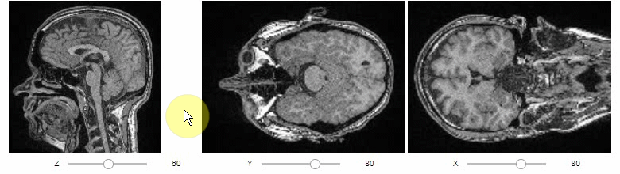
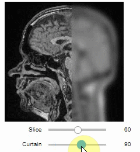

# stackview
Interactive image stack viewing in jupyter notebooks based on 
[numpy_image_widget](https://github.com/Who8MyLunch/Numpy_Image_Widget) and 
[ipywidgets](https://ipywidgets.readthedocs.io/en/latest/).

## Installation

```shell
pip install stackview
```

## Usage
You can use `stackview` from within jupyter notebooks as shown below.
Also check out the [demo notebook on google colab](https://colab.research.google.com/github/haesleinhuepf/stackview/blob/master/docs/demo.ipynb)

Starting point is a 3D image dataset provided as numpy array. 
```python
from skimage.io import imread
image = imread('data/Haase_MRT_tfl3d1.tif', plugin='tifffile')
```

You can then view it slice-by-slice:
```python
stackview.slice(image, continuous_update=True)
```


Orthogonal views are also available:
```python
stackview.orthogonal(image, continuous_update=True)
```


Furthermore, to visualize an original image in combination with a processed version, a curtain view may be helpful:
```python
stackview.curtain(image, modified_image * 65537, continuous_update=True)
```


## Contributing

Contributions, bug-reports and ideas for further development are very welcome.

## License

Distributed under the terms of the [BSD-3] license,
"stackview" is free and open source software

## Issues

If you encounter any problems, please create a thread on [image.sc] along with a detailed description and tag [@haesleinhuepf].

[BSD-3]: http://opensource.org/licenses/BSD-3-Clause
[image.sc]: https://image.sc
[@haesleinhuepf]: https://twitter.com/haesleinhuepf

